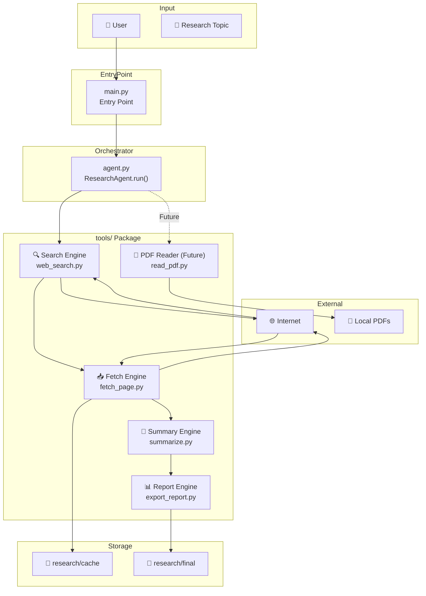
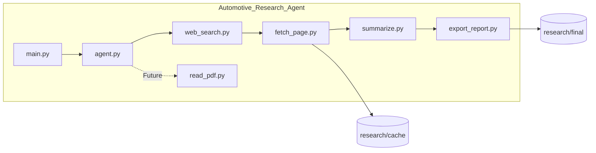
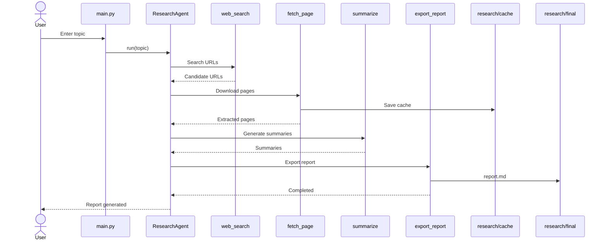

# Automotive Research Agent — Architecture

## Overview

The Automotive Research Agent is a modular Python application designed to automate technical research workflows.

Current workflow:

1. Search candidate URLs
2. Download and extract web page content
3. Generate extractive summaries
4. Export a Markdown research report

The modular architecture enables future extensions such as:

- Azure OpenAI
- RAG (Retrieval-Augmented Generation)
- PDF document processing
- Multi-Agent workflows

---

## System Flow Diagram



---

## Component Diagram



---

## Data Flow



---

## Directory Structure

```text
automotive-research-agent/
│
├── main.py
├── agent.py
├── README.md
├── requirements.txt
├── .gitignore
│
├── docs/
│   ├── architecture.md
│   └── architecture.svg
│
├── tools/
│   ├── web_search.py
│   ├── fetch_page.py
│   ├── summarize.py
│   ├── read_pdf.py
│   └── export_report.py
│
└── research/
    ├── cache/
    │   └── .gitkeep
    └── final/
        └── .gitkeep
```

---

## Current Workflow

```text
User
   │
   ▼
main.py
   │
   ▼
ResearchAgent
   │
   ▼
Search Engine
   │
   ▼
Fetch Engine
   │
   ▼
Summary Engine
   │
   ▼
Report Engine
   │
   ▼
Markdown Report
```

---

## Implementation Status

| Component | Status |
|-----------|--------|
| main.py | ✅ |
| agent.py | ✅ |
| web_search.py | ✅ |
| fetch_page.py | ✅ |
| summarize.py | ✅ |
| export_report.py | ✅ |
| read_pdf.py | 🚧 Planned |
| Azure OpenAI | 🚧 Future |
| RAG | 🚧 Future |
| Multi-Agent | 🚧 Future |
| Docker | 🚧 Future |

---

## Future Roadmap

### v1.1

- Retry mechanism
- Logging
- Better error handling

### v2.0

- Azure OpenAI integration
- AI-generated summaries

### v3.0

- Vector Database
- RAG
- Semantic Search

### v4.0

- Multi-Agent Workflow
- Planning Agent
- Retrieval Agent
- Report Agent