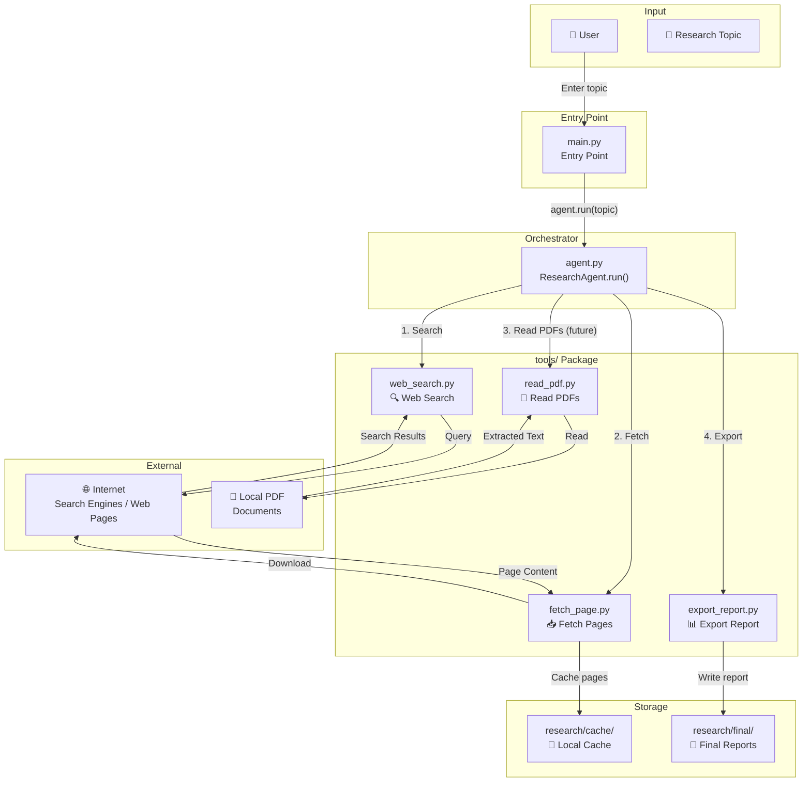
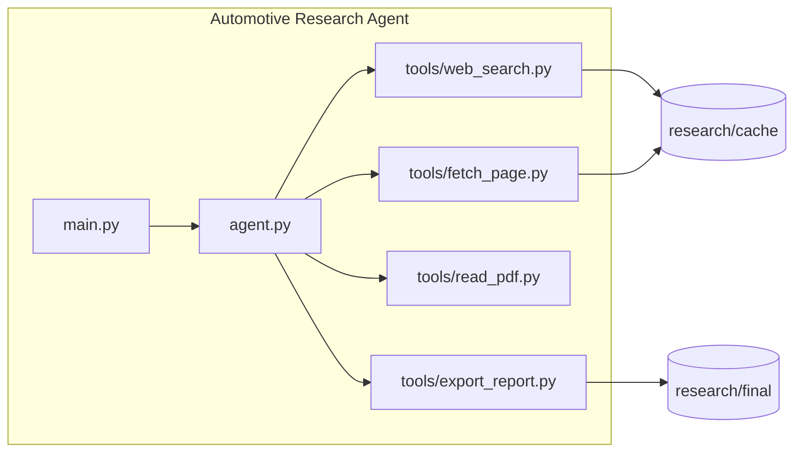
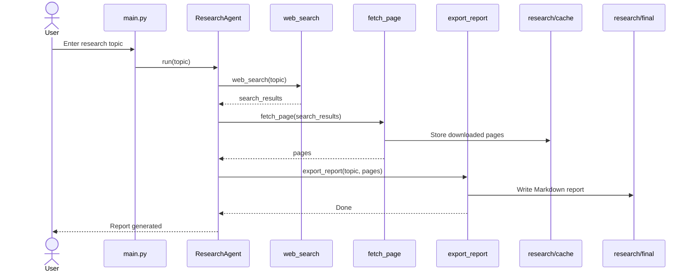

# Automotive Research Agent — Architecture

## System Flow Diagram



## Component Diagram



## Data Flow



## Directory Structure

```
automotive-research-agent/
├── main.py                 # Entry point — CLI interface
├── agent.py                # Orchestrator — workflow logic
├── requirements.txt        # Python dependencies
├── README.md               # Project documentation
├── .gitignore              # Git ignore rules
├── docs/
│   ├── .gitkeep
│   └── architecture.md     # Architecture diagrams (this file)
├── tools/
│   ├── __init__.py         # (to be created)
│   ├── web_search.py       # Web search tool
│   ├── fetch_page.py       # Page fetching tool
│   ├── read_pdf.py         # PDF reading tool
│   └── export_report.py    # Report generation tool
└── research/
    ├── cache/              # Cached web page downloads
    └── final/              # Generated research reports
```

## Implementation Status

| Component | v0.1 | v0.2 | v1.0 |
|---|---|---|---|
| `main.py` | ✅ | ✅ | ✅ |
| `agent.py` | ✅ | ✅ | ✅ |
| `web_search.py` | ❌ | ✅ | ✅ |
| `fetch_page.py` | ❌ | ✅ | ✅ |
| `read_pdf.py` | ❌ | ❌ | ✅ |
| `export_report.py` | ❌ | ✅ | ✅ |
| LLM Integration | ❌ | ❌ | ❌ (future) |
| Docker | ❌ | ❌ | ❌ (future) |